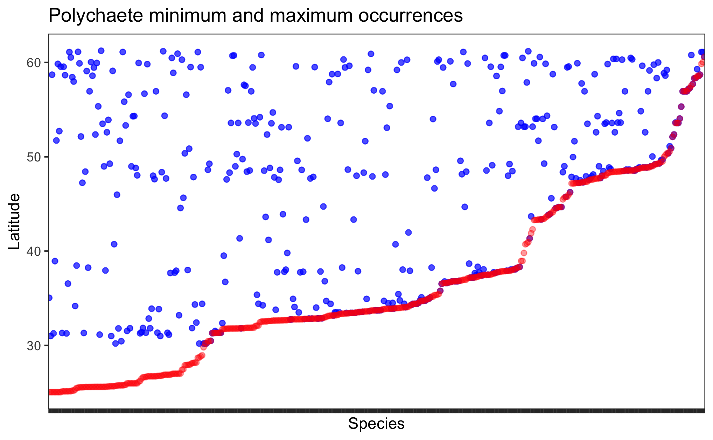

```{r setup, include=FALSE}
# distill for author info
#install.packages('distill')
# generate bibliography for packages used
#remotes::install_github("Pakillo/grateful")
library(grateful)
get_pkgs_info(pkgs = c('rgbif', 'robis', 'worrms',
                       'raster', 'speciesgeocodeR', 'vegan',
                       'mvpart', 'data.tree', 'ape', 'ggtree',
                       'ggplot2', 'ggnewscale',
                       'here', 'tidyverse', 'janitor'))
```

## Introduction

There is a lot of marine diversity along the Pacific coast of North America. The rocky intertidal has been studied intensively throughout recent history. Animals that live there are the livelihood of many coastal communities, either as food or tourist attractions. Additionally, the Northeast Pacific has been identified as a climate change corridor as species respond to warming oceans by moving towards more favorable habitats.

The biogeography of the coastal fauna has been studied in several ways. There are long term surveys, but these are restricted to specific locations as they require setting up a long term transect along flat rocks. This means regions such as British Columbia's fjords are undersampled as habitats that meet the requirements can be difficult, dangerous, or expensive to get to. More recently, biogeographic analyses based on publicly available biodiversity data have identified marine ecoregions throughout the globe. However, these analyses are limited by the biases in the data that they scrape from the public databases. Designing a survey that can overcome limitations of traditional sampling methods and help supplement regions that are missing data can improve our ability to monitor the changes that are already occurring.

A method that shows great promise in this respect is environmental DNA (eDNA). For the past two years, the Pacific eDNA Coastal Observatory (PECO) has sampled eDNA from seagrass beds from San Diego, California to Juneau, Alaska. The first round of data is on the sequencer this month and two chapters of my thesis involve the analysis of this data. So I am using this project to work on developing scripts that will eventually be adapted for the biodiversity data from the eDNA samples, and comparing them to analyses performed on biodiversity data from global repositories.

I identified two classes of marine invertebrates (Polychaetes and Bivalves) that would serve as a solid foundation for testing some of the methods I will eventually use. I looked at the data with simple species richness maps. Then I tried multivariate classification and regression trees (mCART) as implemented in @fenberg_biogeographic_2015 to identify biogeographic breaks. I expected the methods to return concordant results and they did: preliminary analysis recovered 6 biogeographic regions for both Polychaetes and Bivalves. (write about which ones here)

## Methods

*Selection of taxa*

This project focuses on a subset of families from two classes of marine invertebrates: Bivalves and Polychaetes.

Taxa were selected through analysis of a previous eDNA dataset from Calvert Island, BC. These data contained seagrass, kelp, and rocky bottom samples, amplified for COI and filtered to marine invertebrates. I identified generic and species-level assignments that were unique to seagrass samples, and determined which taxa were most abundant in terms of unique species assignments and unique genetic sequences.

Polychaetes had the most species recovered, no matter how the data was grouped. Bivalves, specifically the species *Kurtiella tumida*, had the most unique genetic sequences in most samples, but especially in seagrass samples. However, as bivalves and polychaetes are very large classes with incredible levels of diversity, I restricted the taxonomic query to only families found in our environmental DNA dataset. Databases for assigning taxonomic identifications to genetic data are also notoriously incomplete for invertebrates, so selecting only the species identified in the eDNA samples filters to species that were in the database rather than a biologically meaningful subset. Increasing the query to the family level allows for closely related species and genera absent from the database to be recovered in big data occurrence records while still targeting the search towards the taxa that we found to be highly detectable with eDNA.

However, as the taxa were selected using a temperate dataset, I expect some of the analyses to contradict the expected latitudinal diversity gradient. As the search was run at the family, level this allows for subtropical species not present in our temperate dataset to be found, but it does not allow for subtropical and tropical families that may occupy similar functional groups in seagrass habitats but are absent in temperate latitudes.

As our first round of data from PECO will be fish, selecting invertebrates for this project will allow development of scripts without setting specific expectations for the data to come.

*Data collection*

Data were downloaded from the Global Biodiversity Information Framework (GBIF) and the Ocean Biodiversity Information System (OBIS) on September 9th, 2022 using rgbif [@rgbif2022] and robis [@robis] respectively. Queries included a polygon for the North and Central American Pacific coastline from Alaska to the Equator, and restricted to 6 bivalve families and 11 polychaete families (Appendix). Families were selected for their prevalence in existing eDNA data. There were 85,789 GBIF records and 25,914 OBIS records in the raw dataset.

GBIF data were cleaned by removing high levels of coordinate uncertainty (100 meters of uncertainty for every 1000 meters), removing fossils and machine observations, removing individual counts of 0, removing records with only a family level id, then standardizing taxonomy to match the World Register of Marine Species (WoRMS) [@worms_editorial_board_world_2022] using the worrms package [@worrms]. After cleaning, there were 38,423 GBIF and 18,591 OBIS records.

*Richness maps*

Species richness was mapped separately for polychaetes and bivalves using the 'RichnessGrid' function of the package speciesgeocodeR [@speciesgeocodeR2016b] in R.

*Biogeographic breaks*

Following @fenberg_biogeographic_2015, I used range-through to determine species presence in each 1 degree of latitude bin. I identified the minimum and maximum latitude occurrence of the species and filled the bins between those occurrences with 'presence'. As Fenberg argues, this method to determine presence-absence is an improvement to strictly using the occurrence records as it helps to overcome missing data. Missing data, especially for for marine invertebrate species, is a problem that cannot be understated. Additionally, in @fenberg_biogeographic_2015, there was no real difference between results generated using range-through or occurrence records.

At this point I filter to only the species found within a our study area: 455 polychaete species and 144 bivalve species, and allow a buffer of about 1.5 degrees in each direction to allow for the possibility that a species might have a record slightly below or above the study area but a missing record at the edge.

Then I generated a dissimilarity matrix for each class separately using Jaccard distances, for presence-absence. I visualized the communities for each latitudinal bin with nMDS using the command metaMDS from vegan (citation). Multivariate classification and regression trees (mCART) were then run on the distance matrix vs latitude with the command mvpart from the package mvpart [@mvpart] in R with cross validation set at the minimum tree above 1 standard error, with the option to run a PCA with the results enabled.

## Results

The richness map demonstrated the highest levels of species for both classes richness around cities, as expected from public repository data. (Figure 1)

The nMDS demonstrated demonstrating communities diverging with latitude for both classes. (Figure 2; only Polychaetes shown, Bivalves are similar.)

When minimum and maximum occurrence is organized by latitude, sharp increases and plateaus can be seen (Figure 3).

Both classes formed 6 clusters, with the primary split between northernmost and southernmost clusters occurring approximately where the North Pacific Current splits into the California Current and the Alaska Current. The exact latitudinal position of the cluster boundaries do not entirely match, however. For bivalves, the classic break at Point Conception (\~35N) is recovered, but not for polychaetes.

## Discussion

The results were generally in agreement with @fenberg_biogeographic_2015, with 5 biogeographic breaks identified, forming 6 clusters. However, the breaks were not in the same locations. Partly, this is explained by their finding that different forms of larval development demonstrate alternate patterns. Bivalves strongly resemble their direct development map, with breaks at Point Conception and around Strait of Juan de Fuca. However, most bivalves have free swimming planktonic larvae.

\newpage

## References

::: {#refs}
:::

\newpage

# Figures 

{width="300"} {width="300"}

Figure 1. Polychaete and Bivalve richness maps

{width="600"}

Figure 2. Polychate nMDS by latitudinal bins

{width="600"}

{width="600"}

Figure 3. Polychaete and bivalve species occurrences by minimum and maximum latitude per species, sorted by minimum latitude.

{width="326"} {width="326"}

{width="326"}

Figure 4. a) Polychaete clusters. Polychaete occurrence data along coast, diamonds represent 1 degree bins both colored by cluster. b) Bivalve clusters. Bivalve occurrence data along coast, triangles represent 1 degree bins both colored by cluster. c) Comparison of polychaete bin cluster identities (diamonds) to bivalve bin cluster identities (triangles)

\newpage

# Appendix

### Families selected

Bivalves: Veneridae, Myidae, Glycymerididae, Lasaeidae, Mactridae, Tellinidae

Polychaetes: Polynoidae, Glyceridae, Sabellidae, Goniadidae, Capitellidae, Syllidae, Nereididae, Orbiniidae, "Phyllodocidae, Sigalionidae
